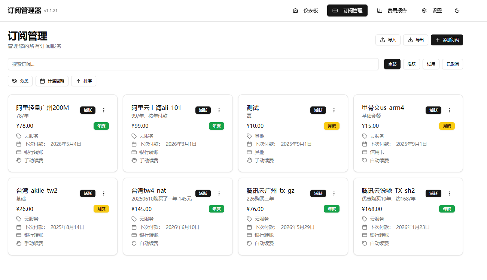
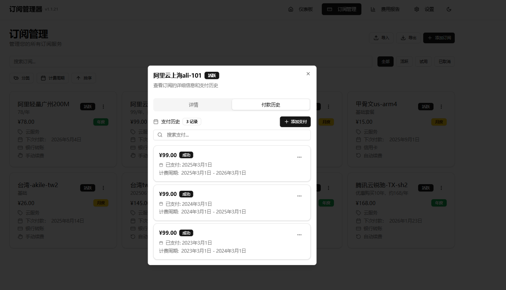
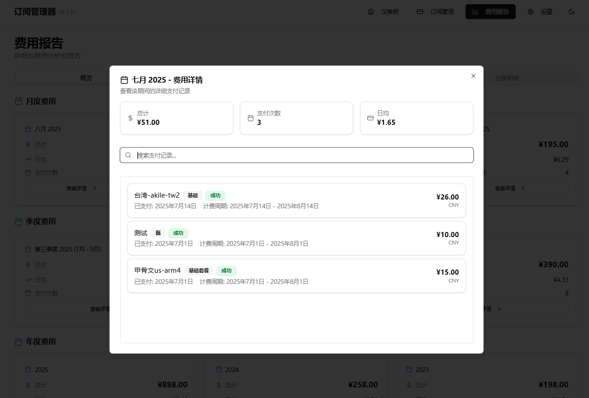
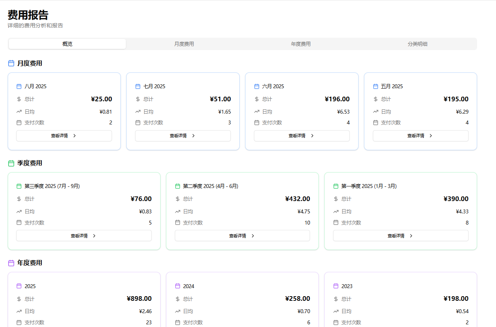
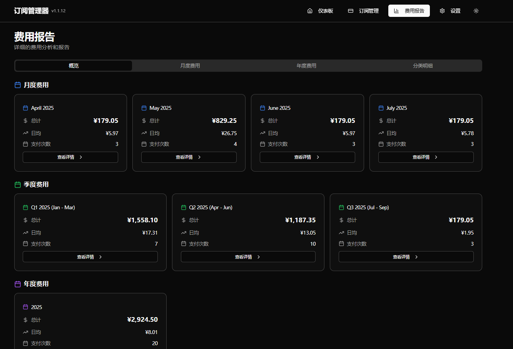

# 订阅管理系统 (Subscription Management System)


一个现代化的订阅管理系统，帮助用户轻松管理和追踪各种订阅服务的费用和续费情况。

**项目暂时没有开源，使用完全免费（但是有大量订阅的用户需要许可密钥才可）**

## 🔗 快速链接

- [🚀 快速开始](#-快速开始)
- [📊 功能特性](#-功能特性)
- [🛠 技术栈](#-技术栈)
- [📚 文档](#-文档)
- [🤝 贡献指南](#-贡献指南)
- [📄 许可证](#-许可证)

## 📸 界面预览

### 仪表板 - 智能费用概览

*智能仪表板展示月度/年度支出统计、即将到期的订阅提醒和分类费用分析*

### 订阅管理 - 完整服务管理

*完整的订阅生命周期管理，支持添加、编辑、状态管理和批量导入*

### 支付历史 - 详细记录追踪

*完整的支付历史记录，支持搜索，以及订单的增删改查*

### 月度费用 - 趋势分析

*月度支出订单，直观展示支出详情*

### 费用报告 - 深度数据分析

*强大的费用分析功能，包含趋势图表、分类统计和多维度数据展示*

### 深色主题 - 现代化界面

*支持深色主题*

## 🌟 项目特色

- **智能订阅管理** - 全面的订阅生命周期管理，支持自动/手动续费，智能到期提醒
- **多币种支持** - 支持8种主要货币（USD, EUR, GBP, CAD, AUD, JPY, CNY, TRY），实时汇率自动更新
- **费用分析报告** - 强大的数据分析和可视化图表功能，支持趋势分析和分类统计
- **响应式设计** - 完美适配桌面和移动端，提供一致的用户体验
- **本地优先** - 基于SQLite的本地数据存储，保护用户隐私，无需云端依赖
- **Docker部署** - 一键部署，开箱即用，支持容器化部署
- **🌍 国际化支持** - 完整的中英文双语支持，支持语言切换，提供本地化用户体验
- **数据导入导出** - 支持CSV和JSON格式的数据导入导出，便于数据迁移和备份
- **智能费用分析** - 支持月度、季度、年度费用分析，自动计算日均支出和支付次数
- **实时汇率更新** - 集成天行数据API，支持自动汇率更新和货币转换
- **🔐 许可证系统** - 集成完整的许可证验证系统，支持免费版、专业版、荣誉终生版
- **智能限制管理** - 基于许可证类型的智能功能限制和订阅数量管理

## 📊 功能特性

### 核心功能
- ✅ **订阅管理** - 添加、编辑、删除订阅服务，支持批量操作
- ✅ **智能仪表板** - 支出概览和即将到期提醒，实时数据更新
- ✅ **分类统计** - 按类别、支付方式统计费用，支持自定义分类
- ✅ **搜索筛选** - 多维度搜索和状态筛选，快速定位订阅
- ✅ **自定义配置** - 自定义分类和支付方式，灵活配置

### 高级功能
- ✅ **自动续费处理** - 智能检测到期订阅并自动更新，支持定时任务
- ✅ **多币种支持** - 8种主要货币实时转换，集成天行数据API自动更新汇率
- ✅ **汇率自动更新** - 每日自动更新汇率数据，确保汇率准确性
- ✅ **费用报告仪表板** - 全面的费用分析和可视化，支持多种图表类型
- ✅ **支付历史追踪** - 完整的支付记录和历史分析，支持搜索和筛选
- ✅ **数据导入导出** - CSV、JSON格式数据导入导出，支持数据迁移
- ✅ **主题切换** - 支持浅色/深色/系统主题，个性化界面
- ✅ **国际化界面** - 完整的中英文双语支持，支持语言切换
- ✅ **定时任务** - 自动续费处理、汇率更新、数据统计等定时任务
- ✅ **许可证验证** - 完整的许可证验证系统，支持远程验证和本地缓存
- ✅ **智能限制管理** - 基于许可证类型的订阅数量限制和功能访问控制
- ✅ **宽限期机制** - 服务器不可用时的智能降级和宽限期处理

### 技术特性
- ✅ **RESTful API** - 完整的API接口，支持前端和后端分离
- ✅ **数据库迁移** - 支持数据库结构升级和迁移
- ✅ **错误处理** - 完善的错误处理和日志记录
- ✅ **健康检查** - 内置健康检查端点，支持容器化部署
- ✅ **API认证** - 基于API Key的安全认证机制

## 🛠 技术栈

### 前端
- **框架**: React 18 + TypeScript
- **构建工具**: Vite 6.3.1
- **样式**: Tailwind CSS + shadcn/ui
- **状态管理**: Zustand 4.5.0
- **路由**: React Router DOM 6.22.1
- **图表**: Recharts 2.15.3
- **UI组件**: Radix UI
- **表单**: React Hook Form 7.56.1
- **主题**: next-themes 0.4.6
- **工具库**: 
  - date-fns 3.6.0 (日期处理)
  - axios 1.10.0 (HTTP客户端)
  - uuid 9.0.1 (唯一标识符)

### 后端
- **运行时**: Node.js 20+
- **框架**: Express 5.1.0
- **数据库**: SQLite + better-sqlite3 12.1.1
- **定时任务**: node-cron 3.0.3
- **API认证**: API Key
- **CORS**: cors 2.8.5
- **HTTP客户端**: axios 1.6.0

### 部署
- **容器化**: Docker + Docker Compose
- **进程管理**: dumb-init
- **健康检查**: 内置健康检查端点
- **多阶段构建**: 前端构建 + 后端部署

### 系统架构

```
┌─────────────────┐    ┌─────────────────┐    ┌─────────────────┐
│   前端 (React)   │    │   后端 (Node.js) │    │   数据库 (SQLite) │
│                 │    │                 │    │                 │
│ - TypeScript    │◄──►│ - Express 5     │◄──►│ - better-sqlite3 │
│ - Vite          │    │ - RESTful API   │    │ - 本地存储       │
│ - Tailwind CSS  │    │ - 中间件        │    │ - 事务支持       │
│ - Zustand       │    │ - 定时任务      │    │ - 外键约束       │
└─────────────────┘    └─────────────────┘    └─────────────────┘
```

### 项目结构

```
Subscription-Management/
├── src/                    # 前端源码
│   ├── components/        # React组件
│   │   ├── ui/           # 基础UI组件
│   │   ├── subscription/ # 订阅相关组件
│   │   ├── dashboard/    # 仪表板组件
│   │   ├── charts/       # 图表组件
│   │   └── layouts/      # 布局组件
│   ├── pages/            # 页面组件
│   ├── store/            # 状态管理
│   ├── services/         # API服务
│   ├── utils/            # 工具函数
│   ├── types/            # TypeScript类型
│   └── locales/          # 国际化文件
├── server/               # 后端源码
│   ├── controllers/      # 控制器层
│   ├── services/         # 服务层
│   ├── routes/           # 路由层
│   ├── middleware/       # 中间件
│   ├── db/              # 数据库相关
│   ├── config/          # 配置文件
│   └── utils/           # 工具函数
├── docs/                # 文档目录
└── docker-compose.yml   # Docker配置
```

### 核心服务
- **订阅管理服务** - 处理订阅的CRUD操作和生命周期管理
- **汇率服务** - 管理多币种汇率转换和自动更新
- **分析服务** - 提供费用分析和统计功能
- **定时任务服务** - 处理自动续费和汇率更新
- **支付历史服务** - 管理支付记录和历史追踪

## 🚀 快速开始

### 系统要求

- **Docker**: 20.10.0 或更高版本（推荐）
- **Node.js**: 20+ 版本（本地开发）
- **内存**: 至少 512MB
- **存储**: 至少 100MB 可用空间
- **网络**: 需要互联网连接（用于汇率更新和许可证验证）

### 部署方式

#### 方式一：Docker run 部署（推荐）

**数据目录准备**

```bash
# 创建数据目录并设置权限
mkdir -p ${PWD}/subscription-manager/data
chown -R 1001:1001 ${PWD}/subscription-manager/data
chmod 755 ${PWD}/subscription-manager/data
```

**停止并删除老的容器**

```bash
# 停止并删除老的容器
docker stop subscription-manager
docker rm subscription-manager
```

**部署应用**

```bash
# 部署
docker run -d \
  --name subscription-manager \
  --restart unless-stopped \
  --user 0 \
  -p 3001:3001 \
  -v ${PWD}/subscription-manager/data:/app/data \
  -e API_KEY="your_secret_api_key_here" \
  -e TIANAPI_KEY="your_tianapi_key_here" \
  -e PORT="3001" \
  -e BASE_CURRENCY="CNY" \
  -e NODE_ENV="production" \
  -e VITE_API_URL="/api" \
  -e DATABASE_PATH="/app/data/database.sqlite" \
  zhoujie218/subscription-manager:latest
```

**访问应用**

- 前端界面: http://localhost:5173


### 首次使用

1. **设置API密钥**
   
   - 配置API密钥 `API_KEY`，就是你的管理订阅的密码
   - 配置货币汇率API `TIANAPI_KEY`（可选，用于自动汇率更新）
   
2. **配置基础货币**
   - 在设置页面选择基础货币
   - 默认支持 CNY, USD, EUR, GBP, CAD, AUD, JPY, TRY

3. **添加订阅**
   - 点击"添加订阅"按钮
   - 填写订阅信息（名称、金额、币种、计费周期等）
   - 选择分类和支付方式

4. **导入数据（可选）**
   - 支持CSV和JSON格式数据导入
   - 在设置页面使用导入功能


### 许可证系统配置

#### 版本类型
- **免费版** - 限制7个订阅，基础功能
- **专业版** - 无限制订阅，1年有效期
- **荣誉终生版** - 无限制订阅，永久有效

#### 激活许可证
1. 访问设置页面
2. 点击"许可证管理"
3. 输入许可证密钥
4. 点击"验证许可证"


### 数据备份

#### 导出数据
```bash
# 通过Web界面导出
# 设置 -> 数据管理 -> 导出数据

# 或直接备份数据库文件
cp server/database.sqlite backup.sqlite
```

#### 导入数据
```bash
# 通过Web界面导入
# 设置 -> 数据管理 -> 导入数据

# 或直接恢复数据库文件
cp backup.sqlite server/database.sqlite
```


### 数据文件位置

- **Docker 部署**：数据库位于 `DATABASE_PATH` 环境变量指定的路径（默认：`/app/data/database.sqlite`）

## 🔧 配置说明

### 环境变量

配置以下变量（可选）：

```bash
# API安全密钥 (必需)
API_KEY=your_secret_api_key_here

# 服务端口 (可选，默认3001)
PORT=3001

# 基础货币 (可选，默认CNY)
BASE_CURRENCY=CNY

# 天行数据API密钥 (可选，用于汇率更新)
TIANAPI_KEY=your_tianapi_key_here

# 数据库路径 (Docker部署时使用)
DATABASE_PATH=/app/data/database.sqlite

# 环境模式 (可选，默认production)
NODE_ENV=production

# 时区设置 (可选，默认Asia/Shanghai)
TZ=Asia/Shanghai
```

### 环境变量说明

| 变量名 | 必需 | 默认值 | 说明 |
|--------|------|--------|------|
| `API_KEY` | ✅ | 无 | API认证密钥，用于保护API接口 |
| `PORT` | ❌ | 3001 | 服务监听端口 |
| `BASE_CURRENCY` | ❌ | CNY | 系统基础货币，用于汇率转换 |
| `TIANAPI_KEY` | ❌ | 无 | 天行数据API密钥，用于自动更新汇率 |
| `DATABASE_PATH` | ❌ | /app/data/database.sqlite | 数据库文件路径 |
| `NODE_ENV` | ❌ | production | 运行环境模式 |
| `TZ` | ❌ | Asia/Shanghai | 系统时区设置 |

### 部署配置

#### Nginx 配置示例
```nginx
server {
    listen 80;
    server_name your-domain.com;
    
    location / {
        proxy_pass http://localhost:3001;
        proxy_set_header Host $host;
        proxy_set_header X-Real-IP $remote_addr;
        proxy_set_header X-Forwarded-For $proxy_add_x_forwarded_for;
        proxy_set_header X-Forwarded-Proto $scheme;
    }
}
```


### 📚 文档导航

- **[快速开始指南](./docs/安装部署指南.md)** - 5分钟快速启动项目
- **[API接口文档](./docs/API接口文档.md)** - 完整的API接口说明


### 📖 用户文档

#### 基本操作

**添加订阅**
1. 点击"添加订阅"按钮
2. 填写订阅信息（名称、金额、计费周期等）
3. 选择分类和支付方式
4. 点击"保存"

**管理订阅**
- **编辑**：点击订阅卡片上的编辑按钮
- **删除**：点击订阅卡片上的删除按钮
- **状态管理**：可以设置订阅为活跃、试用或已取消

**查看报告**
- **仪表板**：查看总体费用概览
- **费用报告**：查看详细的费用分析图表
- **支付历史**：查看所有支付记录

**数据管理**
- **导入数据**：支持CSV和JSON格式数据导入
- **导出数据**：支持CSV和JSON格式数据导出
- **备份数据**：定期备份数据库文件


### API文档

系统提供完整的RESTful API接口，支持以下功能：

- **订阅管理** - 订阅的增删改查操作
- **支付历史** - 支付记录的管理和查询
- **费用分析** - 费用统计和分析接口
- **汇率管理** - 汇率查询和更新接口
- **设置管理** - 系统配置和用户设置
- **许可证验证** - 许可证验证和管理接口

#### 认证方式

系统使用API Key进行认证，需要在请求头中包含：

```
Authorization: Bearer your_api_key_here
```

#### 响应格式

所有API响应都遵循统一的JSON格式：

```json
{
  "success": true,
  "data": {},
  "message": "操作成功",
  "timestamp": "2024-12-19T10:30:00Z"
}
```

#### 核心API接口

**健康检查**
```
GET /api/health
```

**订阅管理**
```
GET    /api/subscriptions              # 获取订阅列表
GET    /api/subscriptions/:id          # 获取单个订阅
POST   /api/protected/subscriptions    # 创建订阅
PUT    /api/protected/subscriptions/:id # 更新订阅
DELETE /api/protected/subscriptions/:id # 删除订阅
POST   /api/protected/subscriptions/bulk # 批量导入
```

**支付历史**
```
GET    /api/payment-history            # 获取支付历史
POST   /api/protected/payment-history  # 创建支付记录
PUT    /api/protected/payment-history/:id # 更新支付记录
DELETE /api/protected/payment-history/:id # 删除支付记录
```

**费用分析**
```
GET /api/analytics/expenses            # 获取费用统计
GET /api/analytics/upcoming-renewals   # 获取即将到期的订阅
GET /api/analytics/recently-paid       # 获取最近支付的订阅
```

**设置管理**
```
GET /api/settings                      # 获取设置
PUT /api/protected/settings            # 更新设置
```

**汇率管理**
```
GET  /api/exchange-rates               # 获取汇率列表
PUT  /api/protected/exchange-rates     # 更新汇率
POST /api/protected/exchange-rates/update # 手动更新汇率
```

**分类和支付方式**
```
GET    /api/categories                 # 获取分类列表
POST   /api/protected/categories       # 创建分类
PUT    /api/protected/categories/:value # 更新分类
DELETE /api/protected/categories/:value # 删除分类

GET    /api/payment-methods            # 获取支付方式列表
POST   /api/protected/payment-methods  # 创建支付方式
PUT    /api/protected/payment-methods/:value # 更新支付方式
DELETE /api/protected/payment-methods/:value # 删除支付方式
```

#### 错误代码

| 错误代码 | 描述 | HTTP状态码 |
|---------|------|-----------|
| `INVALID_API_KEY` | API密钥无效 | 401 |
| `MISSING_API_KEY` | 缺少API密钥 | 401 |
| `SUBSCRIPTION_NOT_FOUND` | 订阅不存在 | 404 |
| `CATEGORY_NOT_FOUND` | 分类不存在 | 404 |
| `PAYMENT_METHOD_NOT_FOUND` | 支付方式不存在 | 404 |
| `INVALID_BILLING_CYCLE` | 无效的计费周期 | 400 |
| `INVALID_STATUS` | 无效的状态 | 400 |
| `INVALID_CURRENCY` | 无效的货币 | 400 |
| `DUPLICATE_CATEGORY` | 分类已存在 | 409 |
| `DUPLICATE_PAYMENT_METHOD` | 支付方式已存在 | 409 |
| `FOREIGN_KEY_CONSTRAINT` | 外键约束违反 | 400 |
| `VALIDATION_ERROR` | 数据验证错误 | 400 |
| `INTERNAL_ERROR` | 内部服务器错误 | 500 |

### 数据库设计

系统使用SQLite数据库，主要包含以下表结构：

- `subscriptions` - 订阅信息表
- `payment_history` - 支付历史表
- `categories` - 分类表
- `payment_methods` - 支付方式表
- `exchange_rates` - 汇率表
- `settings` - 系统设置表
- `monthly_category_summary` - 月度分类汇总表

## 🔍 故障排除

### 常见问题

#### 1. 服务无法启动
```bash
# 检查端口是否被占用
lsof -i :3001

# 检查日志
docker logs subscription-manager
```

#### 2. 数据库错误
```bash
# 重新初始化数据库
cd server
npm run db:reset
```

#### 3. 许可证验证失败
- 检查网络连接
- 确认许可证密钥正确
- 查看许可证服务器状态

#### 4. 汇率更新失败
- 检查 TIANAPI_KEY 是否正确
- 确认网络连接正常
- 查看服务器日志

### 日志查看

#### Docker 日志
```bash
# 查看容器日志
docker logs subscription-manager

# 实时查看日志
docker logs -f subscription-manager
```

## 🤝 贡献指南

### 问题反馈

如果您发现任何问题或有改进建议，请：

1. 查看 [Issues](https://github.com/vbskycn/subm) 是否已有相关讨论

2. 创建新的 Issue，详细描述问题或建议

3. 如果是 Bug，请提供复现步骤和环境信息

4. 如果是功能请求，请说明使用场景和预期效果

   

## 📝 更新日志

### v1.1.22 (2025-08-01)
- ✨ **新增**: 完整的国际化支持，中英文双语界面
- ✨ **新增**: 智能费用分析功能，支持月度、季度、年度分析
- ✨ **新增**: 实时汇率更新功能，集成天行数据API
- 🐛 **修复**: 费用报告页面数据显示问题
- 🐛 **修复**: 季度和年度卡片排序问题
- 🐛 **修复**: 月度费用显示最新4个月的问题
- 🔧 **优化**: 数据库查询性能优化
- 🔧 **优化**: 前端组件渲染性能优化

### v1.1.21 (2025-07-31)
- ✨ **新增**: 支付历史管理功能
- ✨ **新增**: 费用报告和趋势分析
- 🐛 **修复**: 数据库迁移问题
- 🔧 **优化**: 用户界面体验改进

### v1.1.20 (2025-07-30)
- ✨ **新增**: 订阅导入导出功能
- ✨ **新增**: 多币种支持
- 🐛 **修复**: 自动续费处理问题
- 🔧 **优化**: API接口性能优化

## 👥 贡献者

感谢所有为这个项目做出贡献的开发者！

### 主要贡献者
- [@vbskycn](https://github.com/vbskycn/subm) - 项目后续创建者和主要维护者

### 贡献者列表
- [@huhusmang](https://github.com/huhusmang) - 原始项目创建者

---

**⭐ 如果这个项目对您有帮助，请给我们一个星标！**
